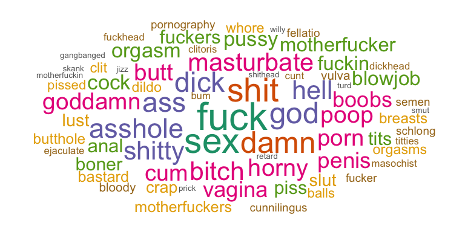
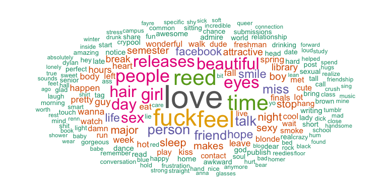
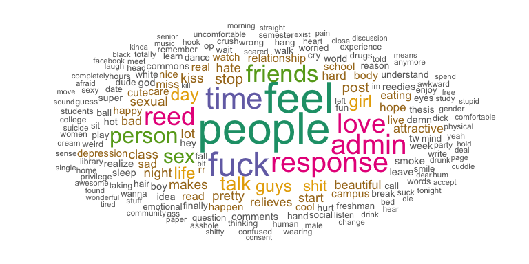
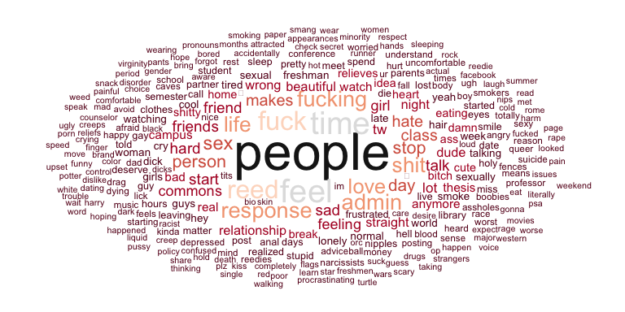
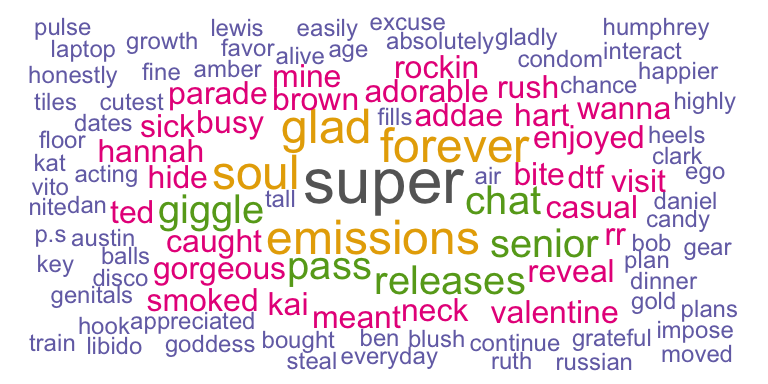
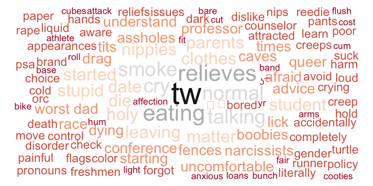
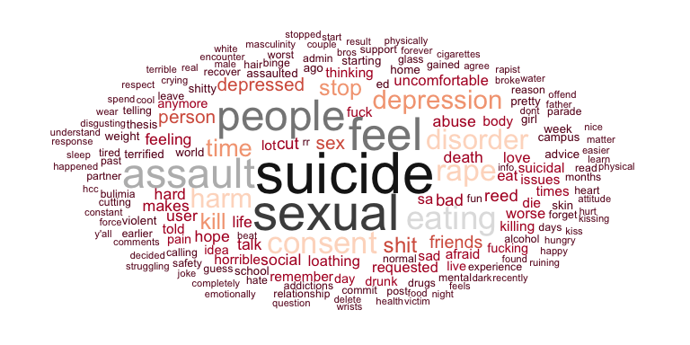
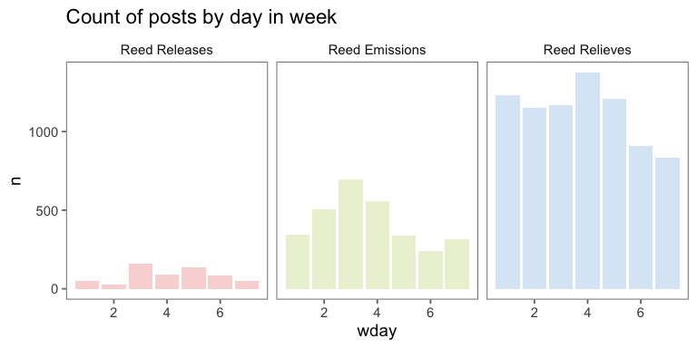
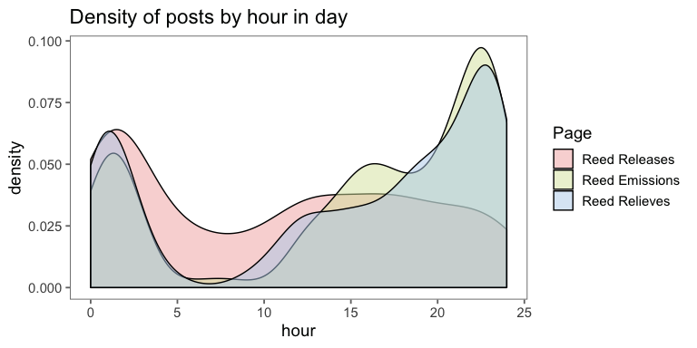

An investigation into the murmurs, musings, and mentions from a memory long forgotten. See the full sized blog [here](http://blakiseskream.github.io/doylehowl)

***

# Introduction 

## Gallon-guzzling technique

It was Dec 6th, 2012 at exactly twenty-seven minutes past midnight that the first howl was heard. Fourteen days before the end of the world, a precursor to what would become a confessional apocalypse began. Somewhere, someone, had collected a brief anonymous testimony and posted it on the popular blogging site [tumblr.com](http://tumblr.com). The text of this confession read simply,

> I know you are leaving Reed forever, but you will never leave my heart. DAT GALLON-GUZZLING TECHNIQUE

A forlorn exaltation into the cyber-sphere, a weary lover lamenting the invetible departure of their sexual compatriot; and - to add emphasis, a praise of fallacious talent. 

> DAT GALLON-GUZZLING TECHNIQUE

The first of thousands confessions to follow, all produced anonymously, all managed by a shadowy few secret keepers who would come and go over the following months. In total three incarnations of the service would be wrought over a course of aproximately 18 months, from winter 2012 through the early autumn 2014. **11,485** posts would be made across the three Tumblr pages, which to this day still rest as a memorial to the emotional milieu of a point in time; and for many, a continuing source of Google-able nostalgia and embarassment.

<!-- -->
  
<span style='font-size: small;'>*Most commonly used profanity words in posts. Sizes are scaled to log of frequency*</span>

With this memorial though we can over the distance of time look back at those thoughts, those memories, those fantasies, and begin to understand through the lens of data and analysis what themes, trends, and cultural shifts occured over those 18 months. Although what comes to follow is by no means exhaustive, it is a first pass at what may be a rich source of information at a raw point in time in the lives of students at the Reed College, in Portland, OR.

## The right to forget

For the sake of privacy, all names have been removed from the quoted posts. Furthermore, the raw data of this analysis is intentionally removed from this analysis and Github page. As we will all begin to see, some things we forget should remain forgotten.

***
# A brief history of time


## In the beginning

College confession pages were nothing new or unique to Reed or the broader internet in winter 2012. Reed had over the years multiple forms of anonymous postings and public internet forums. The Reed College [Live Journal](https://reedlj.livejournal.com/2007/03/19/) (often shortend to just **reedlj**) was perhaps the most prolific and longest lasting of these internet forums. It was a retro interface that mimiced a simple internet forum style. Someone makes a post, others post comments as replies. The posts themselves would generate conversation that would be self-contained within the thread. 

Although not strickly anonymous nor geared towards college confessions, reedlj still existed as the major incarnation of a *cyber-agoros* in the Reed community during the mid-2000's. The forum also was from a pre-Zuckerbergian age of the internet in which anonymous and fluid virtual identity was the norm. Posters and commentors therefore could remain anonymous by the very nature of contributing, blurring the lines between a strict anonymous "confession" type forum, and simply an early version of what we all understand as the Facebook newsfeed. Topics would range from [advice on where to park your car](https://reedlj.livejournal.com/906945.html) to [the pervasive loneliness of the Reed experience](https://reedlj.livejournal.com/222460.html). By [2011](https://reedlj.livejournal.com/2011/12/10/) though almost all the posts were strictly related to housing, rides, jobs, and other classifieds type material.

The usage of reedlj spans over a lengthy 15 year period. During reedlj's height from 2004 to 2010 a core group of users contributed almost daily to the old school "Web 1.0" style forum. In total the reedlj boasted over **7,500** [posts](https://reedlj.livejournal.com/profile) and **57,000** [comments](https://reedlj.livejournal.com/profile) with contributions ongoing from the account's creation on April 6, 2001 to its [most recent post](https://reedlj.livejournal.com/2148878.html) on July 21st, 2016,

> Jul 21 2016, REEDLJ: If anyone is listening...

## Missed Connections

As waves of late Millenials began to swarm the halls of Reed the virtual conversation shifted to the core social networks of the 2010s in which anonymous identity was actively filtered out. By the start of Reed Releases in 2012 Facebook was the primary social feed through which students communicated with each other. Sometimes over college based groups, but mostly over the loose network of friend requests and re-posts that students would idley scroll through on their smudgey Macbook Pros. This is not to say there weren't other major outlets. Tumblr for example, which mantained some of the more chaotic structure of a Live Journal or the original MySpace, was common through parts of the student body, but it was through Facebook that information traveled fastest. 

At the time of Reed Release's creation the only major virtual outlet for anonymous confessionals was the Reed College [Missed Connections](http://www.reedthegrail.com/miss-lonely-hearts/okie-doker). Sent out weekly to the entire student body, the Missed Connections usually had about 10 anonymous blurbs. These blurbs took the style of the famous Craigslist [Missed Connections](https://portland.craigslist.org/search/mis) normally following a "You:", "Me:" structure. 

> Sep 30 2012, Missed Connection #67:
> 
> You: had your onion and jalapeño quesadilla swiped from right under your nose on Saturday night.
>
> Me: the swiper who swiped it and was consumed by guilt when it turned out it wasn't mine. I am so sorry!

They were often small confessionals of love and admiration, or pleas of returning lost items. Moderated by the formal creation of the Student Body Info email (sent weekly by the president of the student body senate), and wedged in between a series of otherwise mundane event reminders and pleas for student participation, the Missed Connections were a small weekly treat to a student body that lusted for affection.

> Dec 4 2011, Missed Connection #165:
> 
> You: My dance partner from the Dome who left on account of her friend. The rest of DJ Scola's set would have been enjoyable with you.
> 
> Me: Hoping for more than a wave goodbye. Maybe we could continue what we started over coffee?

The Missed Connections also required some analog work on the part of the user. Although students could email the Missed Connections in directly to the person who ran it each semester (who's email would be included in the Student Body Info newsletter) more often than not students would submit them the "old fashioned" way: slip a piece of paper into a box in a cafe. This work on the part of the student (either submit virtually and risk detection, or submit anonymously but do it *in the real*) likely helped stem the flow of what would have otherwise been an deluge of confessionals. Only a few hundred missed connections a semester emailed out, and the notifications only came once a week. Each week they were read intently by students everywhere, but the content was recieved in moderation.

> Apr 24 2011, Missed Connection #131:
>
> I've thought about it long and hard / your interests are right up my alley / spending time with you hits the spot / I'll splurge on anything for you-- just say the word and it's yours / But... do you remember me? We once discussed a mutual dislike of picking feet. Need more help remembering?
>
> Shh, no.
>
> If you recently discussed the picking of feet with a sexy someone, say no more. It will all be okay. Meet me in the library lobby 4/27 at 8 pm. I'll be there. Then you'll remember?
>
> Until then, adieu.

The Missed Connections, with their allure of (often times sexy) mystery were incredibly popular. It was through their format, coupled with the rising popularity of online confessionals at other colleges that Reed Releases first came to be.


## Inspired by the good people of Columbia Admirers

The opening disclaimer for Reed Releases in Dec 2012 set the standard that the pages would follow,

> Inspired by the good people of Columbia Admirers, and in no way seeking to infringe on the Student Body Info's jursidiction, this blog seeks to give socially awkward Reedies an outlet for their frustrations, hopes, desires and bodily fluids. Or you could keep it real with expressions of genuine respect and affection.
>
> Releases published on Facebook - friend us to get the dirt!
>
> Anonymous and non-anonymous submissions welcome. Name people or don't.

Over the next two years, although they would be run by different people, called different things, all three pages would remain true to this structure introduced by Reed Releases. Anonymous posts were submitted to the Tumblr pages via the questions feature. On average 4 days out of the week the posts would be copied by administrators of the various pages (admins) and pasted onto the Tumblr and a Facebook page or group. 

<!-- -->

A few early rules of conduct prevailed,

  - If a person was named in a post, the admins would message that person directly (usually on Facebook) and ask for their consent to post
  - Any posts showing troubling or triggering content were branded with a "TW:" tag. This was introduced in Reed Emissions due to commentary on the Facebook page.
  - When people had issues with a post, or comment, they would message the admins Facebook page, and the admins would take the comment or post down
  
Generally however, the admins themselves remained anonymous if not elusive. Hidden by the identify of the Facebook page, the rules, workings, and understandings of what was and was not posted remained opaque. Rumor, questions, and a sense of arbitrary determination surrounded much of what was and was not allowed to be posted on the pages. Regardless, there was effectively very little limitation on the content of what could be posted.

> Reed Emissions #2346: im one of the guys that throws the fish around at the fish market in seattle but what you dont know about me is that i killed a kid in 2003

The Facebook page is where the action would happen. People would comment on the posts, respond to each other, and often times spiral into a vitriolic, viscious, and viral debate. One such thread, "the dread thread", notoriously gained +300 comments before it was finally removed.

> Reed Relieves #5059: What’s the best way to inform a white person that their dreads are gross (both physically dirty and racist)?

This analysis, however, focuses primarily on the anonymous posts themselves. The vast majority of them written by anonymous students in a solitary vacumm, 349,163 words written and submitted by hundreds of ghost writers that will likely remain anonymous for the rest of time.

<table class="table table-striped table-hover" style="width: auto !important; margin-left: auto; margin-right: auto;">
 <thead>
  <tr>
   <th style="text-align:left;"> Page </th>
   <th style="text-align:left;"> First post </th>
   <th style="text-align:left;"> Last post </th>
   <th style="text-align:right;"> Posts </th>
   <th style="text-align:right;"> Mean post length </th>
   <th style="text-align:right;"> Unique words </th>
   <th style="text-align:right;"> # of triggering posts </th>
   <th style="text-align:right;"> % profane </th>
   <th style="text-align:right;"> % names </th>
  </tr>
 </thead>
<tbody>
  <tr>
   <td style="text-align:left;"> Reed Releases </td>
   <td style="text-align:left;"> December 06, 2012 </td>
   <td style="text-align:left;"> February 06, 2013 </td>
   <td style="text-align:right;"> 604 </td>
   <td style="text-align:right;"> 11 </td>
   <td style="text-align:right;"> 2,622 </td>
   <td style="text-align:right;"> 0 </td>
   <td style="text-align:right;"> 2.9% </td>
   <td style="text-align:right;"> 13.3% </td>
  </tr>
  <tr>
   <td style="text-align:left;"> Reed Emissions </td>
   <td style="text-align:left;"> February 04, 2013 </td>
   <td style="text-align:left;"> May 11, 2013 </td>
   <td style="text-align:right;"> 3,001 </td>
   <td style="text-align:right;"> 9 </td>
   <td style="text-align:right;"> 5,854 </td>
   <td style="text-align:right;"> 14 </td>
   <td style="text-align:right;"> 3.7% </td>
   <td style="text-align:right;"> 10.2% </td>
  </tr>
  <tr>
   <td style="text-align:left;"> Reed Relieves </td>
   <td style="text-align:left;"> May 23, 2013 </td>
   <td style="text-align:left;"> September 28, 2014 </td>
   <td style="text-align:right;"> 7,880 </td>
   <td style="text-align:right;"> 10 </td>
   <td style="text-align:right;"> 10,818 </td>
   <td style="text-align:right;"> 149 </td>
   <td style="text-align:right;"> 3.7% </td>
   <td style="text-align:right;"> 9.1% </td>
  </tr>
</tbody>
</table>

## Reed Releases

With **604** total posts Reed Releases was the shortest lived amongst the three pages. It lasted exactly three months, from its first post to its signing off notifcation in February 2013. Due to the winter break in the middle though, Reed Releases popularity was mostly confined to a few weeks over finals.

> I care for you far more than I would ever admit. Please don't give up on yourself. Please don't give up on me.

Reed Releases could also be considered the "purest" of the three incarnations as it did not have ample time to mature and fester. In the sentiment analysis below we will see that it was also the most positive of the pages. Also, notably, Reed Releases didn't have any posts that were formally tagged with a trigger warning.

<!-- -->

<span style='font-size: small;'>*Reed Releases most common words.*</span>

Reed Releases, like the weekly Missed Connections, was focused more on the 1 on 1 interactions that students would have with each other in passing. Posts were often directed at named students, and were confessions of affection, appreciation, or love for one another. This positive appeal is perhaps what drew students to Reed Releases originally, it was a place to see the anamorous outpouring of the college's soul.

> I can't think of anything else except the way you held me. You electrify me, from the bottom of my feet to the flower in my hair. C'mon, let's get our hearts thumping in time and space once again. What do we have to lose?

The genesis of Reed Releases was also well timed. The page started posting on December 06, 2012. The day after the [last day of classes](https://www.reed.edu/registrar/pdfs/reed-academic-calendar-2012-2013.pdf) for the fall semseter in 2012. This is considered the most stressful time of the semester. Final semester projects are due, seniors must submit their first thesis chapter in for review, and finals week is only a few days away. Furthermore, for the proud few Spring/Fall seniors their thesis is due into the library by 3:00 PM on the last day of classes.

At Reed the last day of classes for the fall semester is normally on the Wednesday preceding finals week. On Thursday and Friday of that week seniors who have their last semester in the fall (known as Spring/Fall seniors because they start their thesis in the spring and finish it in the fall) have to defend their thesis to a board of four faculty members. Only after a successful defense of the thesis are they allowed to graduate. At Reed these two days are known as "Reading Week" because faculty need time to read the thesis before they barrage the Spring/Fall seniors with their questions.

> Reed Emissions #2451: I enjoy the stimulant & benzodiazepine abuse I rationalize to myself during finals & reading weeks every semester more than Renn Fayre or any other time of the year I use drugs in general.

For the rest of the student body the Thursday and Friday of Reading Week is two extra days of final projects being due, two extra days of stress before finals, and two extra days of having no obligations during the day other than living in the Hauser Library and flaggelating your brain with calculus proofs and wondering exactly why [Hippocleides didn't care](http://classicalanthology.theclassicslibrary.com/2012/09/10/herodotus-6-126-9-contributed-by-tom-holland/).

<!-- -->

When Reed Releases starting posting the Thursday of Reading Week 2012 it had a very small footprint. Only three posts a day came out during four days of Reading Week and the following weekend. Those posts were simple, contained, and incredibly affectious. They mirrored the style of Missed Connections, pure, hopeful, and full of what was the most popular word in Reed Releases: Love.

> You. Tall scruffy latino chess player. I want your beard. Between my legs. Now.

Once finals started though Reed Releases went viral. The rate of posts picked up dramatically, and the content of the posts began to expand. The increase was rapid and necessary indicative of a student body fervently seeking a voyerist *release* from finals stress.

<!-- -->


## Reed Emissions

Reed Emissions was the second.

<!-- -->

## Reed Relieves

The most popular, most virtiolic, and longest lasting.

<!-- -->

***

# A sentimental journey

Using simple word based sentiment analysis we can begin to see the mood in the language shift over time. The posts were often volatile, with some revealing deep personal horrors and others expressions of pure joy. Peoples memories of the best and worst times of their lives were hurridly typed into the cybersphere for the college to enjoy, discuss, debate, and more often than not - ridicule. A sentiment based aggregation of these posts can reveal that emotional volatility that so permeated the school during those years.


Below is a comparison of different sentiment scoring methods grouping words into a positive vs negative linear scale (-1 to +1).Of all three methodologies, the EmoLex one from Saif Mohammad and Peter Turney was the most thorough, identifying 31.1% of words on average per page.

Reed Releases clearly comes across as more positive vs Reed Emissions and its compatriot Reed Relieves. Perhaps this indicates that as the volume of posts increased over time so did the negative sentiment, or perhaps it is evidence of a general souring of virtual mood over the timer period. Either way, the sentiment transition is stark.

<table class="table table-striped table-hover" style="width: auto !important; ">
 <thead>
  <tr>
   <th style="text-align:left;"> Page </th>
   <th style="text-align:right;"> AFINN </th>
   <th style="text-align:right;"> Bing </th>
   <th style="text-align:right;"> EmoLex </th>
  </tr>
 </thead>
<tbody>
  <tr>
   <td style="text-align:left;"> Reed Releases </td>
   <td style="text-align:right;"> 0.31 </td>
   <td style="text-align:right;"> 0.00 </td>
   <td style="text-align:right;"> 0.24 </td>
  </tr>
  <tr>
   <td style="text-align:left;"> Reed Emissions </td>
   <td style="text-align:right;"> -0.32 </td>
   <td style="text-align:right;"> -0.20 </td>
   <td style="text-align:right;"> 0.13 </td>
  </tr>
  <tr>
   <td style="text-align:left;"> Reed Relieves </td>
   <td style="text-align:right;"> -0.47 </td>
   <td style="text-align:right;"> -0.27 </td>
   <td style="text-align:right;"> 0.08 </td>
  </tr>
</tbody>
</table>

When broken down by time, certain trends begin to come through. Using the AFINN methodology the steady decline in sentiment per post in Reed Emissions leading up to Renn Fayre 2013 is seen clearly. A similar but less discernable decline is also seen in Reed Relieves.

<!-- -->

This pattern would play nicely into Reed cultural narratives around Spring Crises, Junior Quals, and the stress of senior theses. We can start to verify this by observing the frequencey of posts with mentions of the stem or word 'thesis', 'midterm' and or 'qual'.

<!-- -->

The trend is mostly how we would expect. The days leading up to and the week of Renn Fayre see the highest frequency of posts mentioning these stressful, then potentially joyous activities. This is particularly pronounced in the data for Reed Emissions, which sees a steady upward trend of frequencies, mimicing the same trend in declining sentiment.

This, however, can be a sell fulfilling prophecy. Taking a purely exploratory approach we can tease apart the terms mentioned most frequently in those days with the lowest sentiment.

<!-- -->

And compare then the same with the high sentiment days

<!-- -->

Then to truly visualize the difference, observe the words that are not shared across the two sets. 

We can start on a positive note with the high sentiment days. 

<!-- -->

Now contrast that with the words we see on the bottom 10 sentiment days that are *not* present in words seen in the top 10 sentiment days.

<!-- -->

The difference is striking - and incredibly revealing. It's the stuff of life that sets them apart, and most importantly, the stuff of life related to trauma. The fact that not a single post labeled with a trigger warning was located in the top 10 happiest days on these pages casts a new light on the content, and requires us to go deeper.

It's not theses, or midterms, or quals that appear to dictate the mood of the populous. It's trauma, assault, sex, mental health, and identity. The record of that trauma sits in these posts like a mass grave. Through the lens of data we can hope to exhume these years old traumas, and attempt to see how deep that trauma lives.

***

## The triggers

<!-- -->


### The horrors we held

### #MeToo

***

# The gaps

## All the likes we can not see

***
# Appendix

## About me

My name is Andrew. 

## Basic statistics

### Day of week posts

<!-- -->


### Hour of day

<!-- -->

### Share of top 100 words

<!-- -->


### Words per post

<!-- -->

## Data preperation

Extracted with `tumblr_utils.py`. This script downloaded the background JSONs for each blog post. The R script below extracts the necessary data from the JSONs and combines into a single table. This table is saved onto the local computer for future analysis and extraction.


```r
# Libraries
library(tidyverse)
library(jsonlite)
library(lubridate)
library(rvest)

strip_html <- function(s) {
    html_text(read_html(s))
}

# list of files
files <- c(
   list.files("../tumblr-utils/homers-smut.tumblr.com/json/", full.names = TRUE)
 , list.files("../tumblr-utils/reed-emissions.tumblr.com/json/", full.names = TRUE)
 , list.files("../tumblr-utils/reedrelieves.tumblr.com/json/", full.names = TRUE)
 , list.files("../tumblr-utils/rerereves.tumblr.com/json/", full.names = TRUE)

)
length(files)

# empty file
data <- tibble()

# extract json and create data frame
for (file in files) {
  json <- fromJSON(read_lines(file))
  
  question <- ifelse(is.null(json$question), paste0(""), json$question)
  summary  <- ifelse(is.null(json$summary), paste0("") , json$summary)
  content  <- ifelse(
      is.null(json$trail$content_raw)
    , paste0("")
    , str_replace_all(strip_html(json$trail$content_raw), "\n", " ")
  )

  jsonTibble <- tibble(
      id        = as.character(json$id)
    , blog_name = json$blog_name
    , date      = with_tz(ymd_hms(json$date), "America/Los_Angeles")
    , content   = content
    , question  = question
    , summary   = summary
    , short_url = json$short_url
    , post_type = json$type
  )

  data <- data %>% bind_rows(jsonTibble)
}
```

You can then perform the heroku upload


## Common words

## Variation in language over time

## Use of gender
