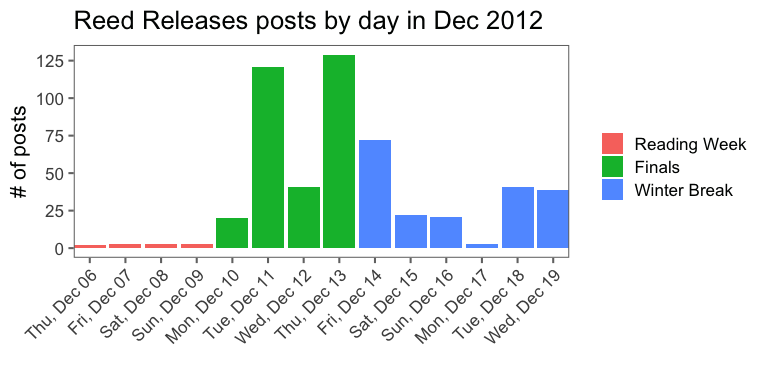
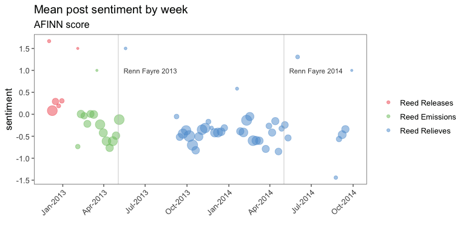

An investigation into the murmurs, musings, and mentions from a memory long forgotten. 

***

# Introduction 

## Gallon-guzzling technique

It was Dec 6th, 2012 at exactly twenty-seven minutes past midnight that the first howl was heard. Fourteen days before the end of the world, a precursor to what would become confessional apocalypse began. Somewhere, someone, had collected a brief anonymous testimony and posted it on the popular blogging site tumblr.com. The text of this first spark of what would be a raging emotional inferno was simply,

> I know you are leaving Reed forever, but you will never leave my heart. DAT GALLON-GUZZLING TECHNIQUE

A forlorn exaltation into the cyber-sphere, a weary lover lamenting the invetible departure of their sexual compatriot; and - to add emphasis, a praise of fallacious talent. 

> DAT GALLON-GUZZLING TECHNIQUE

The first of thousands confessions to follow, all produced anonymously, all managed by a shadowy few secret keepers who would come and go over the proceeding months. In total three incarnations of the service would be wrought over a course of aproximately 18 months, from winter 2012 through the early autumn 2014. 11485 posts would be made across the three Tumblr pages, which to this day still rest as a memorial to the emotional milieu of a point in time; and for many, a continuing source of Google-able nostalgia, and embarassment.

<!-- -->
  
<span style='font-size: small;'>*Most commonly used profanity words in posts. Sizes are scaled to log of frequency*</span>

With this memorial though, we can over the distance of time look back at those thoughts, those memories, those incarnations, and begin to understand through the lens of data and analysis what themes, trends, and cultural shifts occured over those 18 months. Although what comes to follow is by no means exhaustive, it is a first pass at what may be a rich source of information at a raw point in time in the lives of students at the Reed College, in Portland, OR.

## The right to forget

For the sake of privacy, all names have been removed from the quoted posts. Furthermore, the raw data of this analysis, and the location of the pages, is intentionally removed from this analysis and Github page. As we will all begin to see, some things we forget should remain forgotten.

***
# A brief history of time

<!-- -->


College confession pages were nothing new or unique to Reed or the broader internet in winter 2012. Reed had, over the years, multiple forms of anonymous postings and public internet forums. The Reed College Missed Connections were a popular form of communicating anonymously into the ether. Sent out weekly to the entire student body, the Missed Connections usually had about 10 anonymous blurbs

Although called different things, and run by different people, all three pages mantained a simple structure. Anonymous posts were submitted to the Tumblr pages via the questions feature. On average 4 days out of the week the posts would be copied by administrators of the various pages (admins) and pasted onto the Tumblr and a Facebook page or group. A few early rules of conduct prevailed,

  - If a person was named in a post, the admins would message that person directly (usually on Facebook) and ask for their consent to post
  - Any posts showing troubling or triggering content were branded with a "TW:" tag
  - When people had issues with a post, or comment, they would message the admins Facebook page, and the admins would take the comment or post down
  
Generally however, the admins themselves remained anonymous if not elusive. Hidden by the identify of the Facebook page, the rules, workings, and understandings of what was and was not posted remained opaque. Rumor, questions, and a sense of arbitrary determination surrounded much of what was and was not allowed to be posted on the pages. Regardless, there was effectively very little limitation on the content of what could be posted.

> RE 2346: im one of the guys that throws the fish around at the fish market in seattle but what you dont know about me is that i killed a kid in 2003

The Facebook page is where the action would happen. People would comment on the posts, respond to each other, and often times spiral into a vitriolic, viscious, and viral debate. One such thread, "the dread thread", notoriously gained +300 comments before it was finally removed.

> RR 5059: What’s the best way to inform a white person that their dreads are gross (both physically dirty and racist)?

This analysis, however, focuses primarily on the anonymous posts themselves. The vast majority of them written by anonymous students in a solitary vacumm, 349,163 words written and submitted by hundreds of ghost writers that will likely remain anonymous for the rest of time.

<table class="table table-striped table-hover" style="width: auto !important; margin-left: auto; margin-right: auto;">
 <thead>
  <tr>
   <th style="text-align:left;"> Page </th>
   <th style="text-align:left;"> First post </th>
   <th style="text-align:left;"> Last post </th>
   <th style="text-align:right;"> Posts </th>
   <th style="text-align:right;"> Mean post length </th>
   <th style="text-align:right;"> Unique words </th>
   <th style="text-align:right;"> # of triggering posts </th>
   <th style="text-align:right;"> % profane </th>
   <th style="text-align:right;"> % names </th>
  </tr>
 </thead>
<tbody>
  <tr>
   <td style="text-align:left;"> Reed Releases </td>
   <td style="text-align:left;"> December 06, 2012 </td>
   <td style="text-align:left;"> February 06, 2013 </td>
   <td style="text-align:right;"> 604 </td>
   <td style="text-align:right;"> 11 </td>
   <td style="text-align:right;"> 2,622 </td>
   <td style="text-align:right;"> 0 </td>
   <td style="text-align:right;"> 2.9% </td>
   <td style="text-align:right;"> 13.3% </td>
  </tr>
  <tr>
   <td style="text-align:left;"> Reed Emissions </td>
   <td style="text-align:left;"> February 04, 2013 </td>
   <td style="text-align:left;"> May 11, 2013 </td>
   <td style="text-align:right;"> 3,001 </td>
   <td style="text-align:right;"> 9 </td>
   <td style="text-align:right;"> 5,854 </td>
   <td style="text-align:right;"> 14 </td>
   <td style="text-align:right;"> 3.7% </td>
   <td style="text-align:right;"> 10.2% </td>
  </tr>
  <tr>
   <td style="text-align:left;"> Reed Relieves </td>
   <td style="text-align:left;"> May 23, 2013 </td>
   <td style="text-align:left;"> September 28, 2014 </td>
   <td style="text-align:right;"> 7,880 </td>
   <td style="text-align:right;"> 10 </td>
   <td style="text-align:right;"> 10,818 </td>
   <td style="text-align:right;"> 149 </td>
   <td style="text-align:right;"> 3.7% </td>
   <td style="text-align:right;"> 9.1% </td>
  </tr>
</tbody>
</table>

## Reed Releases

Reed releases was the first, with 0 total posts, it was also the shortest lived lasting exactly three months, from its first post to its signing off notifcation in February 2013. Reed Releases could also be considered the "purest" of the three incarnations as it did not have ample time to mature and fester. In the sentiment analysis below we will see that it was also the most positive of the pages. Also, notably, Reed Releases didn't have any posts that were formally tagged with a trigger warning.

<!-- -->

Reed Releases, like the weekly Missed Connections, was focused more on the 1 on 1 interactions that students would have with each other in passing. Posts were often directed at named students, and were confessions of affection, appreciation, or love for one another. This positive appeal is perhaps what drew students to Reed Releases originally, it was a place to see the anamorous outpouring of the college's soul.

> I can't think of anything else except the way you held me. You electrify me, from the bottom of my feet to the flower in my hair. C'mon, let's get our hearts thumping in time and space once again. What do we have to lose?

The gensis of Reed Releases was also well timed. The page start posting on December 06, 2012. The day after the [last day of classes](https://www.reed.edu/registrar/pdfs/reed-academic-calendar-2012-2013.pdf) for the fall semseter in 2012. Although it was on the At Reed the last day of classes for the fall semester is normally on the Wednesday preceding finals week. This is so that the Thursday and Friday

<!-- -->


## Reed Emissions

Reed Emissions was the second.

<!-- -->

## Reed Relieves

<!-- -->

***

# A sentimental journey

Using simple word based sentiment analysis we can begin to see the mood in the language shift over time. The posts were often volatile, with some revealing deep personal horrors and others expressions of pure joy. Peoples memories of the best and worst times of their lives were hurridly typed into the cybersphere for the college to enjoy, discuss, debate, and more often than not - ridicule. A sentiment based aggregation of these posts can reveal that emotional volatility that so permeated the school during those years.


Below is a comparison of different sentiment scoring methods grouping words into a positive vs negative linear scale (-1 to +1).Of all three methodologies, the EmoLex one from Saif Mohammad and Peter Turney was the most thorough, identifying 31.1% of words on average per page.

Reed Releases clearly comes across as more positive vs Reed Emissions and its compatriot Reed Relieves. Perhaps this indicates that as the volume of posts increased over time so did the negative sentiment, or perhaps it is evidence of a general souring of virtual mood over the timer period. Either way, the sentiment transition is stark.

<table class="table table-striped table-hover" style="width: auto !important; ">
 <thead>
  <tr>
   <th style="text-align:left;"> Page </th>
   <th style="text-align:right;"> AFINN </th>
   <th style="text-align:right;"> Bing </th>
   <th style="text-align:right;"> EmoLex </th>
  </tr>
 </thead>
<tbody>
  <tr>
   <td style="text-align:left;"> Reed Releases </td>
   <td style="text-align:right;"> 0.31 </td>
   <td style="text-align:right;"> 0.00 </td>
   <td style="text-align:right;"> 0.24 </td>
  </tr>
  <tr>
   <td style="text-align:left;"> Reed Emissions </td>
   <td style="text-align:right;"> -0.32 </td>
   <td style="text-align:right;"> -0.20 </td>
   <td style="text-align:right;"> 0.13 </td>
  </tr>
  <tr>
   <td style="text-align:left;"> Reed Relieves </td>
   <td style="text-align:right;"> -0.47 </td>
   <td style="text-align:right;"> -0.27 </td>
   <td style="text-align:right;"> 0.08 </td>
  </tr>
</tbody>
</table>

When broken down by time, certain trends begin to come through. Using the AFINN methodology the steady decline in sentiment per post in Reed Emissions leading up to Renn Fayre 2013 is seen clearly. A similar but less discernable decline is also seen in Reed Relieves.

<!-- -->

This pattern would play nicely into Reed cultural narratives around Spring Crises, Junior Quals, and the stress of senior theses. We can start to verify this by observing the frequencey of posts with mentions of the stem or word 'thesis', 'midterm' and or 'qual'.

<!-- -->

The trend is mostly how we would expect. The days leading up to and the week of Renn Fayre see the highest frequency of posts mentioning these stressful, then potentially joyous activities. This is particularly pronounced in the data for Reed Emissions, which sees a steady upward trend of frequencies, mimicing the same trend in declining sentiment.

This, however, can be a sell fulfilling prophecy. Taking a purely exploratory approach we can tease apart the terms mentioned most frequently in those days with the lowest sentiment.

<!-- -->

And compare then the same with the high sentiment days

<!-- -->

Then to truly visualize the difference, observe the words that are not shared across the two sets. 

We can start on a positive note with the high sentiment days. 

<!-- -->

Now contrast that with the words we see on the bottom 10 sentiment days that are *not* present in words seen in the top 10 sentiment days.

<!-- -->

The difference is striking - and incredibly revealing. It's the stuff of life that sets them apart, and most importantly, the stuff of life related to trauma. The fact that not a single post labeled with a trigger warning was located in the top 10 happiest days on these pages casts a new light on the content, and requires us to go deeper.

It's not theses, or midterms, or quals that appear to dictate the mood of the populous. It's trauma, assault, sex, mental health, and identity. The record of that trauma sits in these posts like a mass grave. Through the lens of data we can hope to exhume these years old traumas, and attempt to see how deep that trauma lives.

***

## The triggers

<!-- -->


### The horrors we held

### #MeToo

***

# The gaps

## All the likes we can not see

***
# Appendix

## About me

My name is Andrew. 

## Basic statistics

### Day of week posts

<!-- -->


### Hour of day

<!-- -->

### Share of top 100 words

<!-- -->


### Words per post

<!-- -->

## Data preperation

Extracted with `tumblr_utils.py`. This script downloaded the background JSONs for each blog post. The R script below extracts the necessary data from the JSONs and combines into a single table. This table is saved onto the local computer for future analysis and extraction.


```r
# Libraries
library(tidyverse)
library(jsonlite)
library(lubridate)
library(rvest)

strip_html <- function(s) {
    html_text(read_html(s))
}

# list of files
files <- c(
   list.files("../tumblr-utils/homers-smut.tumblr.com/json/", full.names = TRUE)
 , list.files("../tumblr-utils/reed-emissions.tumblr.com/json/", full.names = TRUE)
 , list.files("../tumblr-utils/reedrelieves.tumblr.com/json/", full.names = TRUE)
 , list.files("../tumblr-utils/rerereves.tumblr.com/json/", full.names = TRUE)

)
length(files)

# empty file
data <- tibble()

# extract json and create data frame
for (file in files) {
  json <- fromJSON(read_lines(file))
  
  question <- ifelse(is.null(json$question), paste0(""), json$question)
  summary  <- ifelse(is.null(json$summary), paste0("") , json$summary)
  content  <- ifelse(
      is.null(json$trail$content_raw)
    , paste0("")
    , str_replace_all(strip_html(json$trail$content_raw), "\n", " ")
  )

  jsonTibble <- tibble(
      id        = as.character(json$id)
    , blog_name = json$blog_name
    , date      = with_tz(ymd_hms(json$date), "America/Los_Angeles")
    , content   = content
    , question  = question
    , summary   = summary
    , short_url = json$short_url
    , post_type = json$type
  )

  data <- data %>% bind_rows(jsonTibble)
}
```

You can then perform the heroku upload


## Common words

## Variation in language over time

## Use of gender
