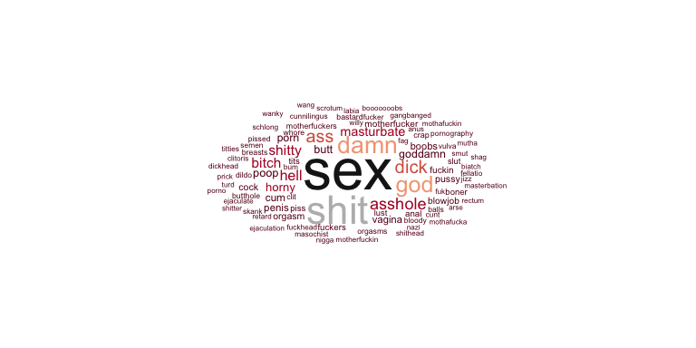
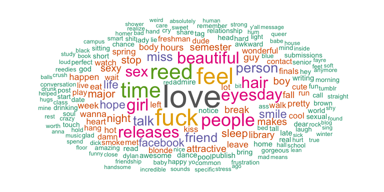
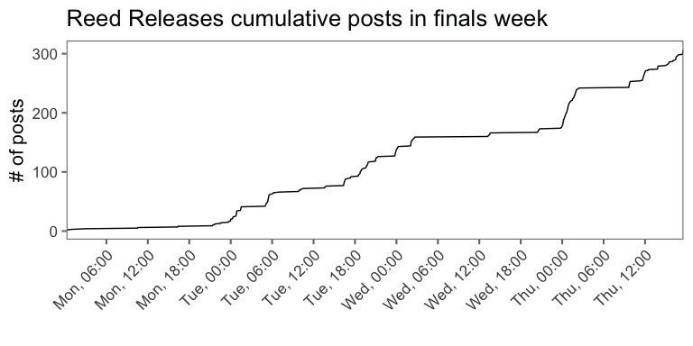
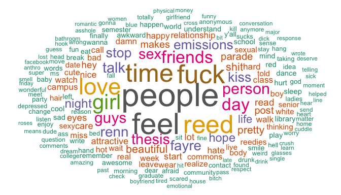
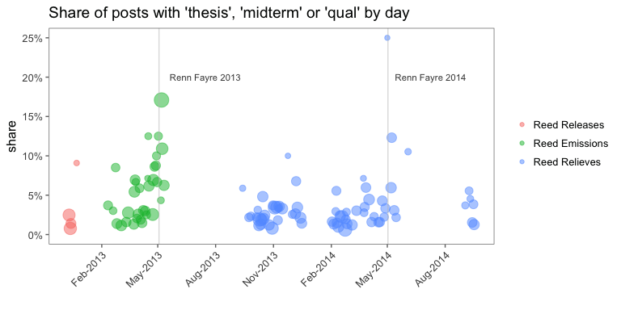

An investigation into the murmurs, musings, and mentions from a memory long forgotten. 

***

# Introduction 

## Gallon-guzzling technique

It was Dec 6th, 2012 at exactly twenty-seven minutes past midnight that the first howl was heard. Fourteen days before the end of the world, a precursor to what would become confessional apocalypse began. Somewhere, someone, had collected a brief anonymous testimony and posted it on the popular blogging site tumblr.com. The text of this first spark of what would be a raging emotional inferno was simply,

> I know you are leaving Reed forever, but you will never leave my heart. DAT GALLON-GUZZLING TECHNIQUE""

A forlorn exaltation into the cyber-sphere, a weary lover lamenting the invetible departure of their sexual compatriot; and - to add emphasis, a praise of fallacious talent. 

> DAT GALLON-GUZZLING TECHNIQUE

The first of thousands confessions to follow, all produced anonymously, all managed by a shadowy few secret keepers who would come and go over the proceeding months. In total three incarnations of the service would be wrought over a course of aproximately 18 months, from winter 2012 through the early autumn 2014. **11,485** posts would be made across the three Tumblr pages, which to this day still rest as a memorial to the emotional milue of a point in time; and for many, a continuing source of Google-able nostalgia, and embarassment.

<!-- -->

<span style='font-size: small;'>*Most commonly used profanity words in posts*</span>

With this memorial though, we can over the distance of time look back at those thoughts, those memories, those incarnations, and begin to understand through the lens of data and analysis what themes, trends, and cultural shifts occured over those 18 months. Although what comes to follow is by no means exhaustive, it is a first pass at what may be a rich source of information at a raw point in time in the lives of students at the Reed College, in Portland, OR.

## The right to forget

For the sake of privacy, all names have been removed from the quoted posts. Furthermore, the raw data of this analysis, and the location of the pages, is intentionally removed from this analysis and Github page. As we will all begin to see, some things we forget should remain forgotten

***
# A brief history of time

<!-- -->


College confession pages were nothing new or unique to Reed or the broader internet in winter 2012. Reed had, over the years, multiple forms of anonymous postings and public internet forums. The Reed College Missed Connections were a popular form of communicating anonymously into the ether. Sent out weekly to the entire student body, the Missed Connections usually had about 10 anonymous blurbs

Although called different things, and run by different people, all three pages mantained a simple structure. Anonymous posts were submitted to the Tumblr pages via the questions feature. Four days out of the week the posts would be copied by administrators of the various pages (admins) and pasted onto the Tumblr and a Facebook page or group. A few early rules of conduct prevailed,

  - If a person was named in a post, the admins would message that person directly (usually on Facebook) and ask for their consent to post
  - Any posts showing troubling or triggering content were branded with a "TW:" tag
  - When people had issues with a post, or comment, they would message the admins Facebook page, and the admins would take the comment or post down
  
Generally however, the admins themselves remained anonymous if not elusive. Hidden by the identify of the Facebook page, the rules, workings, and understandings of what was and was not posted remained opaque. Rumor, questions, and a sense of arbitrary determination surrounded much of what was and was not allowed to be posted on the pages. Regardless, there was effectively very little limitation on the content of what could be posted.

> RE 2346: im one of the guys that throws the fish around at the fish market in seattle but what you dont know about me is that i killed a kid in 2003

The Facebook page is where the action would happen. People would comment on the posts, respond to each other, and often times spiral into a vitriolic, viscious, and viral debate. One such thread, "the dread thread", notoriously gained +300 comments before it was finally removed.

> RR 5059: What’s the best way to inform a white person that their dreads are gross (both physically dirty and racist)?

This analysis, however, focuses primarily on the anonymous posts themselves. The vast majority of them written by anonymous students in a solitary vacumm, 349,000 words written and submitted by hundreds of ghost writers that will likely remain anonymous for the rest of time.

<table class="table table-striped table-hover" style="width: auto !important; ">
 <thead>
  <tr>
   <th style="text-align:left;"> Page </th>
   <th style="text-align:left;"> First post </th>
   <th style="text-align:left;"> Last post </th>
   <th style="text-align:right;"> Count </th>
  </tr>
 </thead>
<tbody>
  <tr>
   <td style="text-align:left;"> Reed Releases </td>
   <td style="text-align:left;"> December 06, 2012 </td>
   <td style="text-align:left;"> February 06, 2013 </td>
   <td style="text-align:right;"> 604 </td>
  </tr>
  <tr>
   <td style="text-align:left;"> Reed Emissions </td>
   <td style="text-align:left;"> February 04, 2013 </td>
   <td style="text-align:left;"> May 11, 2013 </td>
   <td style="text-align:right;"> 3001 </td>
  </tr>
  <tr>
   <td style="text-align:left;"> Reed Relieves </td>
   <td style="text-align:left;"> May 23, 2013 </td>
   <td style="text-align:left;"> September 28, 2014 </td>
   <td style="text-align:right;"> 7880 </td>
  </tr>
</tbody>
</table>

## Reed Releases

Reed releases was the first, with 604 total posts, it was also the shortest lived lasting exactly three months, from its first post to its signing off notifcation in February 2013. Reed Releases could also be considered the "purest" of the three incarnations as it did not have 

<!-- -->

## Reed Emissions

<!-- -->

## Reed Relieves

<!-- -->

***

# The frequentist approach

## Posting patterns

<!-- -->

## Common words

## Variation in language over time

## Use of gender

***

# A sentimental journey

## A basic sentiment pass

### The days we wept

### The days we laughed

## What was triggering

<!-- -->


### The horrors we held

### #MeToo

***

# The gaps

## All the likes we can not see

***
# Appendix

## About me

My name is Andrew. 

## The code

The code blocks below detail how the analysis above was performed

### Data preperation

Extracted with `tumblr_utils.py`. This script downloaded the background JSONs for each blog post. The R script below extracts the necessary data from the JSONs and combines into a single table. This table is saved onto the local computer for future analysis and extraction.


```r
# Libraries
library(tidyverse)
library(jsonlite)
library(lubridate)
library(rvest)

strip_html <- function(s) {
    html_text(read_html(s))
}

# list of files
files <- c(
   list.files("../tumblr-utils/homers-smut.tumblr.com/json/"    , full.names = TRUE)
 , list.files("../tumblr-utils/reed-emissions.tumblr.com/json/" , full.names = TRUE)
 , list.files("../tumblr-utils/reedrelieves.tumblr.com/json/"   , full.names = TRUE)
)
length(files)

# empty file
data <- tibble()

# extract json and create data frame
for (file in files) {
  json <- fromJSON(read_lines(file))
  
  question <- ifelse(is.null(json$question), paste0(""), json$question)
  summary  <- ifelse(is.null(json$summary), paste0("") , json$summary)
  content  <- ifelse(
      is.null(json$trail$content_raw)
    , paste0("")
    , str_replace_all(strip_html(json$trail$content_raw), "\n", " ")
  )

  jsonTibble <- tibble(
      id        = as.character(json$id)
    , blog_name = json$blog_name
    , date      = with_tz(ymd_hms(json$date), "America/Los_Angeles")
    , content   = content
    , question  = question
    , summary   = summary
    , short_url = json$short_url
    , post_type = json$type
  )

  data <- data %>% bind_rows(jsonTibble)
}

# Save data to local postgres db
library(RPostgres)
library(DBI)

con <- dbConnect(RPostgres::Postgres())
dbWriteTable(con, "doyle_howl_data", data, overwrite = TRUE)

# check it there
dbGetQuery(con, "SELECT COUNT(*) FROM doyle_howl_data;")
```

### Basic statistics


```r
title <- "Density of posts by day in week"
  data %>%
    group_by(page, wday) %>%
    count() %>%
  ggplot(aes(x = wday, y = n, fill = page)) +
    geom_col(alpha = 0.5, color = rgb(0,0,0,0)) +
    facet_wrap(~page) +
    guides(fill = FALSE) +
    ggtitle(title) +
    theme_few(base_size = 14)
```

<!-- -->

```r
title <- "Density of posts by day in week"
page_words %>%
  group_by(page) %>%
  mutate(norm_freq = freq / sum(freq)) %>%
  top_n(100) %>%
  ggplot(aes(x = norm_freq, fill = page)) + 
  geom_density(alpha = 0.5) + 
  scale_x_continuous(label = percent) +
  ggtitle(title)
```

<!-- -->
